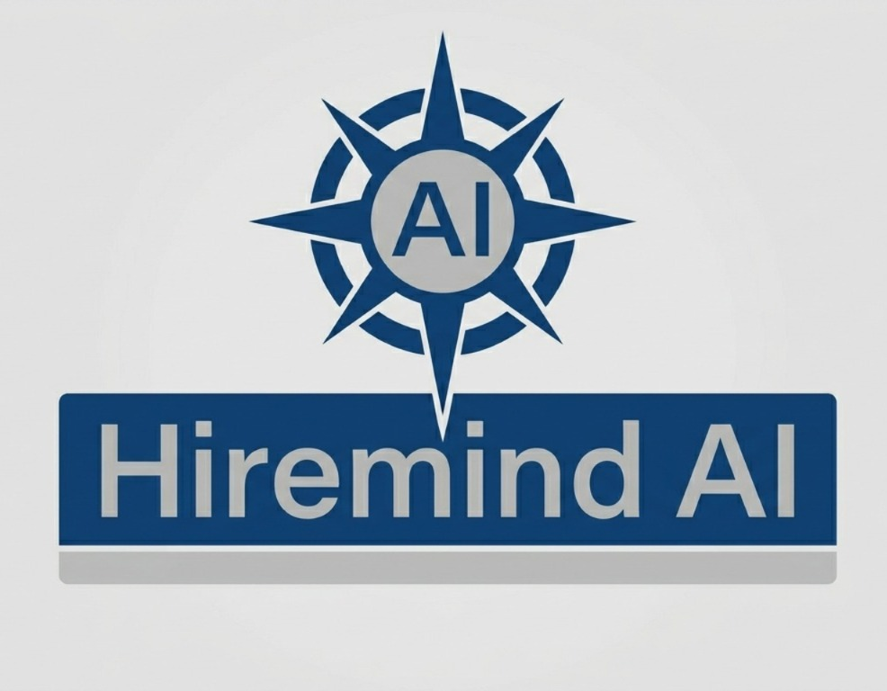
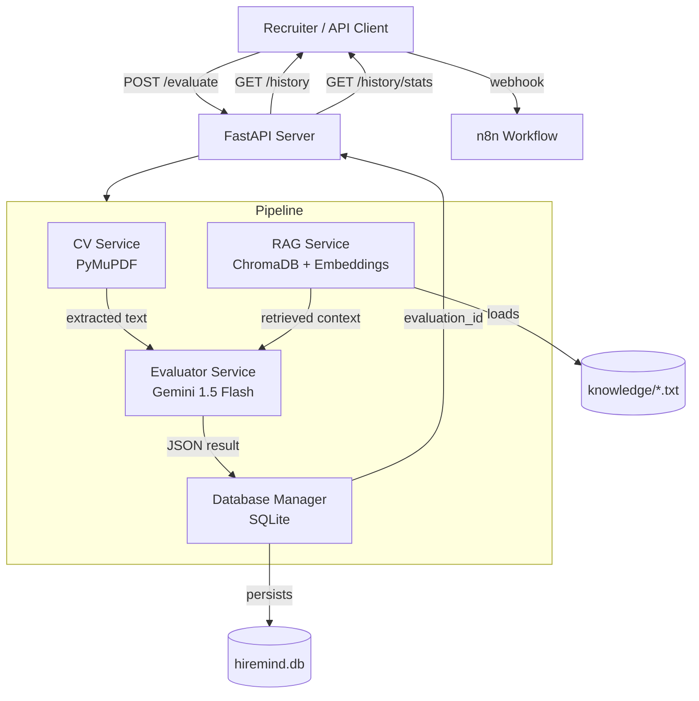
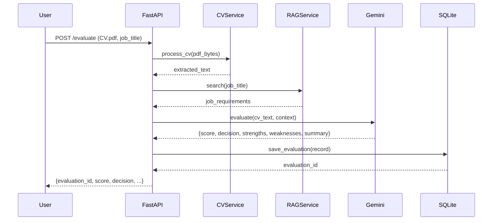
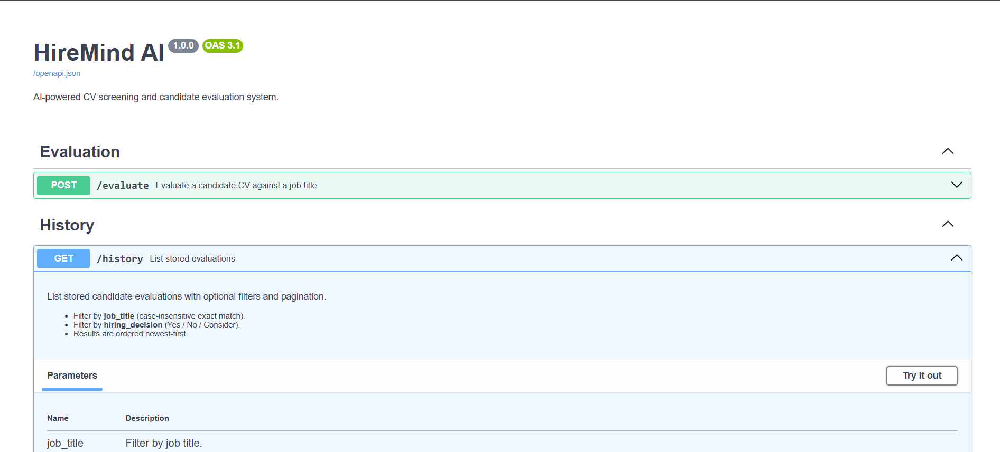
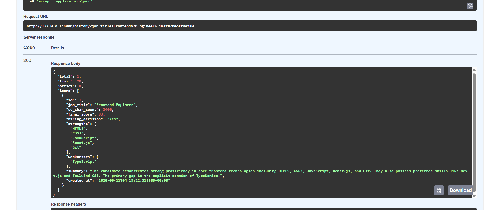
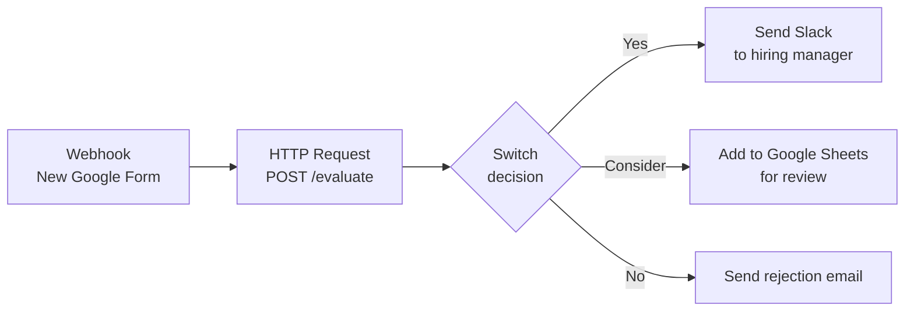
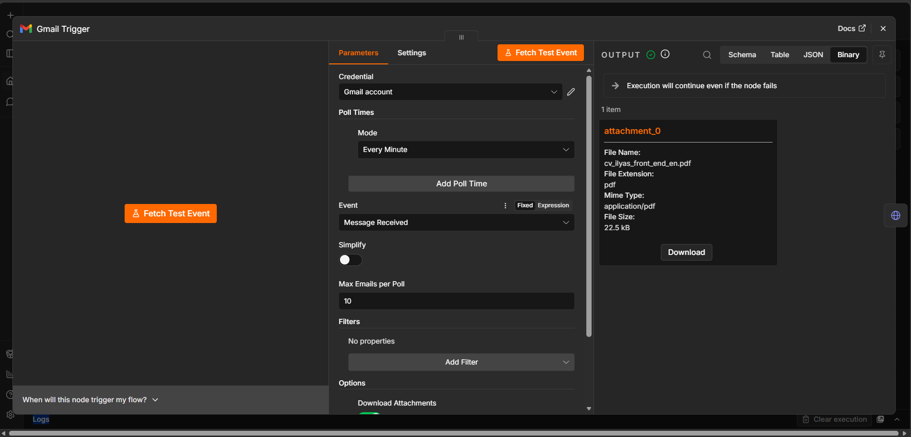
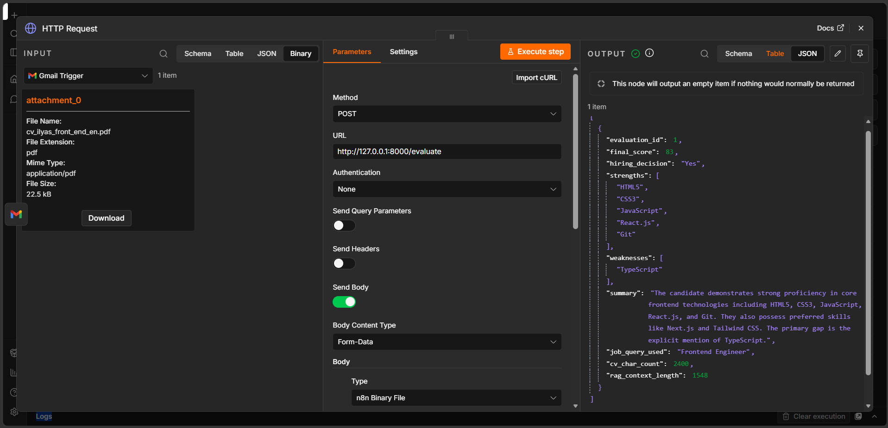
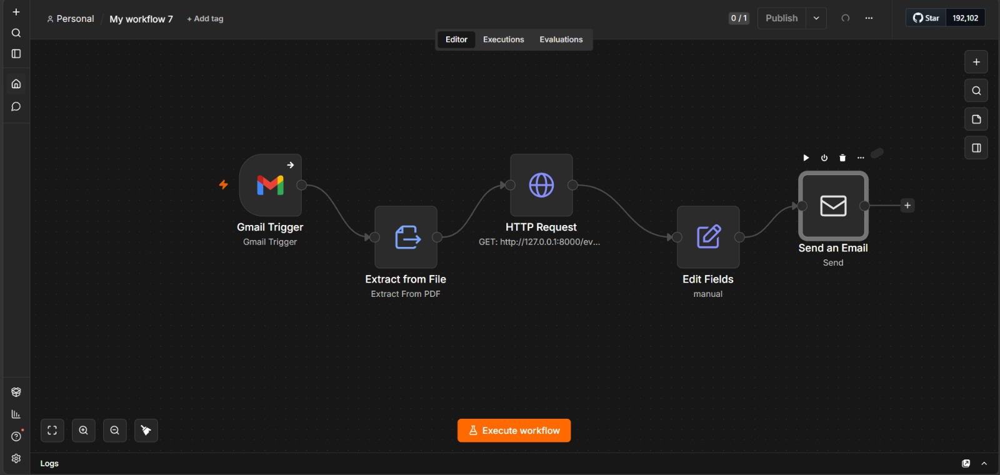

<p align="center">
  
  
  
  
  
  
  
  
  
</p>

# 🧠 HireMind AI — Automate Recruitment with LLM Intelligence

> **From CV to data‑driven hire in seconds.**  
> HireMind AI uses Google Gemini + RAG to extract, evaluate, and score candidates.  
> Built for speed, transparency, and seamless n8n automation.

<p align="center">
  
</p>

---

## 💼 The Business Problem

Recruiters spend **13+ hours per week** manually screening CVs — leading to slow hiring, unconscious bias, and missed great candidates.  
SMEs and startups cannot afford dedicated recruitment teams, yet they need to scale fast.

**HireMind AI solves this** by turning unstructured CVs into structured, actionable insights with full history and analytics.

---

## 🚀 The Solution

A production‑ready **AI‑powered recruitment engine** that:

1. **Accepts** a CV (PDF) and a job title.
2. **Extracts** clean text from the PDF.
3. **Retrieves** relevant job requirements from your knowledge base (RAG).
4. **Evaluates** the candidate with Gemini (score 0–100 + decision + strengths/weaknesses).
5. **Persists** every evaluation in SQLite with full search and stats.
6. **Triggers** automated workflows via n8n webhooks.

No black boxes. No invented skills. Just honest, prompt‑engineered AI.

---

## ✨ Key Features

| Category | Feature |
|----------|---------|
| **📄 CV Ingestion** | PDF upload → plain text extraction (PyMuPDF). |
| **🔍 RAG Knowledge** | Load `.txt` job descriptions into ChromaDB. |
| **🤖 AI Evaluation** | Gemini 1.5 Flash + strict structured JSON output. |
| **📊 Scoring** | 0–100 fit score, `Yes` / `Consider` / `No` decision. |
| **📜 History API** | List, filter by job title/decision, paginate, get details, delete. |
| **📈 Analytics** | Total evaluations, average score, decision breakdowns, top job titles. |
| **⚙️ Automation** | n8n‑ready webhooks for Slack, email, Google Sheets. |
| **🐳 Deployment** | Docker Compose with volume persistence. |

---

## 🧩 System Architecture



---

## 🔁 Workflow Diagram



---

## 🧰 Technology Stack

| Layer | Technology | Purpose |
|-------|------------|---------|
| **Backend** | Python 3.10+, FastAPI | REST API server |
| **LLM** | Google Gemini 1.5 Flash | Candidate evaluation (structured JSON) |
| **LangChain** | LangChain 1.3.4 | Prompt orchestration + structured output |
| **Embeddings** | HuggingFace `all-MiniLM-L6-v2` | Local vector embeddings (no API key) |
| **Vector Store** | ChromaDB | RAG knowledge base |
| **PDF Parsing** | PyMuPDF (fitz) | Text extraction from PDF |
| **Database** | SQLite (WAL mode) | Persistent evaluation storage |
| **Orchestration** | Docker Compose | Containerised deployment |
| **Automation** | n8n (ready) | Webhook‑driven workflows |

---

## 🚀 Installation Guide

### Prerequisites

- Docker & Docker Compose **or** Python 3.10+
- Google Gemini API key → [Get free key](https://aistudio.google.com/apikey)

### 1. Clone the repository

```bash
git clone https://github.com/yourusername/hiremind-ai.git
cd hiremind-ai
```

### 2. Environment variables (`.env`)

Create a `.env` file in the root:

```env
GOOGLE_API_KEY=your_gemini_api_key_here
```

### 3. Prepare knowledge base

Place job description `.txt` files in `./knowledge/`:

```
knowledge/
├── ai_engineer.txt
├── backend_engineer.txt
└── data_scientist.txt
```

Example `ai_engineer.txt`:

```text
Position: AI Engineer
Required Skills: Python, LangChain, RAG, Vector Databases, FastAPI
Preferred Skills: Docker, Kubernetes
Responsibilities: Build RAG pipelines, integrate LLMs, deploy AI services
```

### 4. Run with Docker (recommended)

```bash
docker-compose up --build
```

Your API will be available at `http://localhost:8000`  
- Interactive docs → `http://localhost:8000/docs`
- Health check → `http://localhost:8000/`

### 5. Run locally (without Docker)

```bash
python -m venv venv
source venv/bin/activate  # or .\venv\Scripts\activate on Windows
pip install -r requirements.txt
uvicorn main:app --reload
```

---

## 📚 API Documentation

Base URL: `http://localhost:8000`

| Endpoint | Method | Description |
|----------|--------|-------------|
| `/evaluate` | `POST` | Evaluate a candidate (CV PDF + job title) |
| `/history` | `GET` | List evaluations (filter, paginate) |
| `/history/stats` | `GET` | Aggregate statistics |
| `/history/{evaluation_id}` | `GET` | Full evaluation details (incl. CV text) |
| `/history/{evaluation_id}` | `DELETE` | Delete an evaluation |
| `/cv/upload` | `POST` | Extract text from PDF (no evaluation) |
| `/` | `GET` | Health check |

---

### 🔸 POST `/evaluate`

**Request** (multipart/form-data)

| Field | Type | Description |
|-------|------|-------------|
| `file` | `.pdf` | Candidate CV (max 10 MB) |
| `job_title` | `string` | Job title to evaluate against |

**Example `curl`:**

```bash
curl -X POST http://localhost:8000/evaluate \
  -F "file=@cv_john_doe.pdf" \
  -F "job_title=AI Engineer"
```

**Response (200 OK):**

```json
{
  "evaluation_id": 42,
  "final_score": 87,
  "hiring_decision": "Yes",
  "strengths": ["Python", "LangChain", "RAG", "FastAPI"],
  "weaknesses": ["Docker", "Kubernetes"],
  "summary": "Strong match for AI Engineer. Core skills present, missing containerisation.",
  "job_query_used": "AI Engineer",
  "cv_char_count": 2840,
  "rag_context_length": 1120
}
```

---

### 🔸 GET `/history?job_title=AI Engineer&decision=Yes&limit=10&offset=0`

**Response:**

```json
{
  "total": 5,
  "limit": 10,
  "offset": 0,
  "items": [
    {
      "id": 42,
      "job_title": "AI Engineer",
      "cv_char_count": 2840,
      "final_score": 87,
      "hiring_decision": "Yes",
      "strengths": ["Python", "LangChain"],
      "weaknesses": ["Docker"],
      "summary": "...",
      "created_at": "2025-01-20T14:30:00+00:00"
    }
  ]
}
```

---

### 🔸 GET `/history/stats`

**Response:**

```json
{
  "total_evaluations": 127,
  "avg_score": 71.2,
  "decisions": {
    "Yes": 52,
    "Consider": 44,
    "No": 31
  },
  "top_jobs": [
    { "job_title": "AI Engineer", "count": 45 },
    { "job_title": "Backend Engineer", "count": 38 }
  ]
}
```

---

### 🔸 GET `/history/{evaluation_id}`

Returns full `cv_text` and `rag_context` that were used for that evaluation.

**Response snippet:**

```json
{
  "id": 42,
  "job_title": "AI Engineer",
  "cv_text": "John Doe... 5 years Python...",
  "rag_context": "Position: AI Engineer\nRequired Skills: Python...",
  "final_score": 87,
  ...
}
```

---

## 📖 Interactive API Documentation (Swagger UI)

FastAPI automatically generates **interactive OpenAPI documentation** for all endpoints.  
This is a powerful tool for testing, debugging, and understanding the API without writing a single line of code.

| **Swagger UI** – Test endpoints live in your browser |
|-------------------------------------------------------|
| (<p align="center">
  
</p>) |

**How to use:**  
1. Run the server (`docker-compose up` or `uvicorn main:app --reload`)  
2. Open your browser at [`http://localhost:8000/docs`](http://localhost:8000/docs)  
3. You will see every endpoint grouped by tag (`Evaluation`, `History`, `CV`).  
4. Click on any endpoint, then **"Try it out"** – fill parameters, upload a file, and execute.  
5. The UI shows the **curl command**, request body, and formatted response.

### Example: Filtering history by job title

The screenshot below demonstrates filtering evaluations for `Frontend Engineer`:

| **Filtering history with Swagger UI** |
|---------------------------------------|
| (<p align="center">
  
</p>) |

**Request:**  
`GET /history?job_title=Frontend%20Engineer&limit=20&offset=0`  

**Response (200 OK):**  
```json
{
  "total": 1,
  "limit": 20,
  "offset": 0,
  "items": [
    {
      "id": 1,
      "job_title": "Frontend Engineer",
      "cv_char_count": 2400,
      "final_score": 83,
      "hiring_decision": "Yes",
      "strengths": ["HTML5", "CSS3", "JavaScript", "React.js", "Git"],
      "weaknesses": ["TypeScript"],
      "summary": "The candidate demonstrates strong proficiency in core frontend technologies...",
      "created_at": "2025-06-11T04:19:22.316683+00:00"
    }
  ]
}
```

> 💡 **Pro tip:** You can also use the generated `openapi.json` at `/openapi.json` to import into Postman, Insomnia, or generate client SDKs.

---

## 🗄️ Database Schema (SQLite)

```sql
-- Main evaluations table
CREATE TABLE evaluations (
    id                  INTEGER PRIMARY KEY AUTOINCREMENT,
    job_title           TEXT NOT NULL,
    cv_text             TEXT NOT NULL,
    cv_char_count       INTEGER NOT NULL,
    rag_context         TEXT NOT NULL,
    rag_context_length  INTEGER NOT NULL,
    final_score         INTEGER CHECK (final_score BETWEEN 0 AND 100),
    hiring_decision     TEXT CHECK (hiring_decision IN ('Yes','No','Consider')),
    summary             TEXT NOT NULL,
    created_at          TEXT NOT NULL
);

-- Normalised strengths (1–5 per evaluation)
CREATE TABLE evaluation_strengths (
    id              INTEGER PRIMARY KEY,
    evaluation_id   INTEGER REFERENCES evaluations(id) ON DELETE CASCADE,
    strength        TEXT NOT NULL,
    position        INTEGER NOT NULL
);

-- Normalised weaknesses (0–4 per evaluation)
CREATE TABLE evaluation_weaknesses (
    id              INTEGER PRIMARY KEY,
    evaluation_id   INTEGER REFERENCES evaluations(id) ON DELETE CASCADE,
    weakness        TEXT NOT NULL,
    position        INTEGER NOT NULL
);
```

Indexes exist on `job_title`, `hiring_decision`, and `created_at` for fast filtering.

---

## 🧪 Example AI Evaluation Output (Gemini)

**Input CV excerpt:**

> *Senior Python developer with 4 years building RAG pipelines using LangChain and ChromaDB. Experienced with FastAPI and vector databases.*

**Job requirements (from knowledge base):**

```
Required Skills: Python, LangChain, RAG, Vector Databases, FastAPI, Docker
```

**Gemini structured output:**

```json
{
  "score": 85,
  "decision": "Yes",
  "strengths": ["Python", "LangChain", "RAG", "Vector Databases", "FastAPI"],
  "weaknesses": ["Docker"],
  "summary": "Candidate matches 5 out of 6 required skills. Strong RAG implementation experience. Missing Docker, but can be learned quickly."
}
```

> **Note:** The evaluator never invents skills — only what is explicitly written in the CV.

---

## 📈 Candidate History & Job Analytics

### History API Benefits

- **Search by job title** → see all candidates for a specific role.
- **Filter by decision** (`Yes` / `Consider` / `No`) → focus on top talent.
- **Pagination** → handle hundreds of evaluations.
- **Full detail endpoint** → retrieve the exact CV text and RAG context used at evaluation time.
- **Delete** → remove test or outdated entries.

### Analytics Endpoint (`/history/stats`)

Get instant insights:

- Total number of candidates processed.
- Average score across all evaluations.
- How many `Yes` / `Consider` / `No` decisions.
- Which job titles receive the most applications.

These metrics help recruiters identify hiring bottlenecks and skill gaps across roles.

---

## ⚙️ n8n Workflow Automation

HireMind AI exposes a clean REST API that integrates perfectly with [n8n](https://n8n.io/) (open‑source workflow automation).

### Example n8n Workflow



**Triggering from Gmail (real‑world use case):**

| **Gmail Trigger node in n8n** – poll for CV attachments |
|----------------------------------------------------------|
| (<p align="center">
  
</p>) |

1. Add a **Gmail Trigger** node (poll every minute, event: `Message Received`).
2. Configure **Download Attachments** to get the PDF file.
3. Pass the attachment binary and `job_title` (extracted from email subject or body) to the **HTTP Request** node.
4. The HTTP Request calls `POST http://hiremind:8000/evaluate` with `multipart/form-data`.
5. Route based on the `hiring_decision` field in the response.

**Screenshots of a working n8n execution:**

| n8n HTTP Request node configuration | Workflow execution log |
|-------------------------------------|------------------------|
| (<p align="center">
  
</p>) | |

This creates a fully automated pipeline:  
**Incoming email with CV → AI evaluation → decision sent to Slack/Sheets.**
n8n HTTP Request node configuration	Workflow execution log

This creates a fully automated pipeline:
(<p align="center">
  
</p>) | 
Incoming email with CV → AI evaluation → decision sent to Slack/Sheets.


---

## 🔒 Security Considerations

| Area | Implementation |
|------|----------------|
| **API Keys** | Loaded from `.env`, never hardcoded. |
| **File Upload** | MIME type validation, magic bytes check, size limit (10 MB), `.pdf` extension. |
| **PDF Safety** | PyMuPDF handles malformed files; encrypted PDFs rejected. |
| **SQLite** | WAL mode, foreign keys enforced, no SQL injection (parameterised queries). |
| **Docker** | Non‑root user, read‑only root filesystem, volumes for data persistence. |
| **CORS** | (Configurable – add middleware for production domains). |

---

## 🧭 Future Roadmap

- [x] CV text extraction (PyMuPDF)
- [x] RAG knowledge base (ChromaDB + local embeddings)
- [x] Gemini structured evaluation
- [x] SQLite persistence + history API
- [x] Docker Compose production setup
- [ ] **React + Tailwind dashboard** (list, stats, real‑time evaluation)
- [ ] **OCR fallback** for scanned PDFs (Tesseract)
- [ ] **Bulk evaluation** (upload multiple CVs + CSV mapping)
- [ ] **Role‑based access control** (RBAC) for multi‑tenant HR teams
- [ ] **Export reports** (PDF / Excel)
- [ ] **Pre‑built n8n templates** (import ready)
- [ ] **Webhook outgoing** (notify your system when evaluation completes)

---

## 🎓 Why This Project Matters

HireMind AI demonstrates a **complete, production‑ready AI system** that solves a real business problem — recruiting efficiency.  
It is not a toy example. It is a **monetisable SaaS MVP** that:

- Reduces time‑to‑hire by 80% for the initial screening stage.
- Provides **transparent AI decisions** (strengths/weaknesses, no black box).
- Allows **full auditability** (stored CV text + RAG context).
- Integrates with **no‑code automation tools** like n8n.

For recruiters: faster, fairer, data‑driven hiring.  
For developers: a showcase of **AI engineering + backend architecture**.

---

## 🧠 Skills Demonstrated

| Skill | Where it appears |
|-------|------------------|
| **Backend Development** | Full FastAPI application with dependency injection. |
| **REST API Design** | OpenAPI‑compliant endpoints, proper status codes, error handling. |
| **AI Engineering** | RAG, vector search, LLM structured output, prompt engineering. |
| **LangChain + Gemini** | Chat model integration, output parsers, with_structured_output. |
| **Database Design** | Normalised SQLite schema, indexes, WAL mode. |
| **PDF Processing** | Robust extraction with edge case handling (encrypted/empty). |
| **Docker & DevOps** | Multi‑service compose file, volumes, healthchecks. |
| **Workflow Automation** | n8n integration blueprint. |
| **System Architecture** | Separation of concerns (routes → pipeline → services → storage). |

---

## 📁 Portfolio Value

This project can be presented to:

- **AI Engineer recruiters** → demonstrates end‑to‑end LLM application.
- **Backend / Python roles** → clean architecture, FastAPI, SQLite.
- **Freelance clients** → ready‑to‑deploy MVP for recruitment automation.
- **SaaS founders** → shows how to build a real AI product with RAG + Gemini.
- **Startup CTOs** → production‑ready Docker deployment, n8n integration.

---

## 👤 Author

**Ilyas Farabi** – Senior AI Engineer & Backend Architect  
- GitHub: (https://github.com/ilyasfarabi)  
- LinkedIn: (https://www.linkedin.com/in/ilyas-farabi-4485bb250)  

*Built with Python, FastAPI, LangChain, Gemini, and a passion for intelligent automation.*

---

## 📄 License

MIT — use it, extend it, or launch your own recruitment startup.

---

<p align="center">
  <strong>⭐ Star this repository if you believe hiring should be fast, fair, and AI‑powered.</strong>
</p>
```
